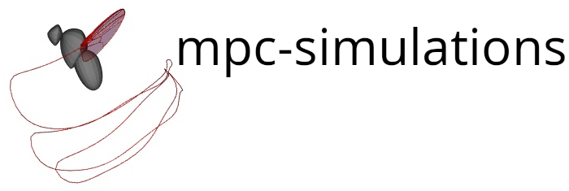

Model Predictive Control (MPC) simulations from Melis and Dickinson 2023.


### Installation
Download source and cd into source directory. Then to install using pip run 

```bash
pip install .
```

or to install using [poetry](https://python-poetry.org/) run

```bash
poetry install
```

Software dependencies should be automatically downloaded during the
installation. 

## Jupyter notebook 

cd into the project's notebook directory and run 

```bash
jupyter notebook MPC_simulations.ipynb
```

### GIFs

---

### Forward Flight


--- 

### Saccade Right

